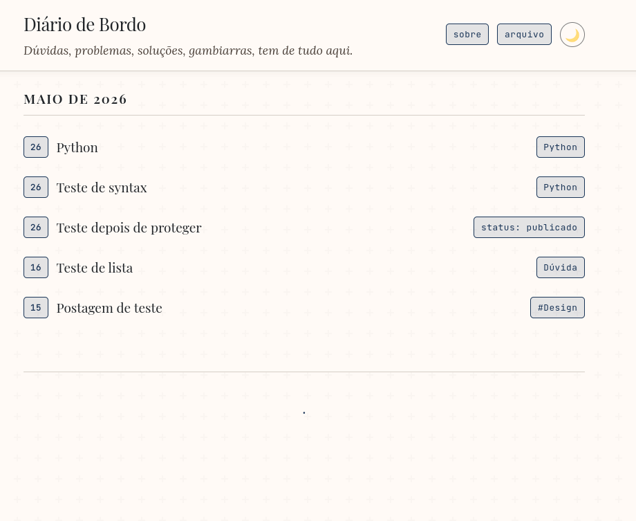
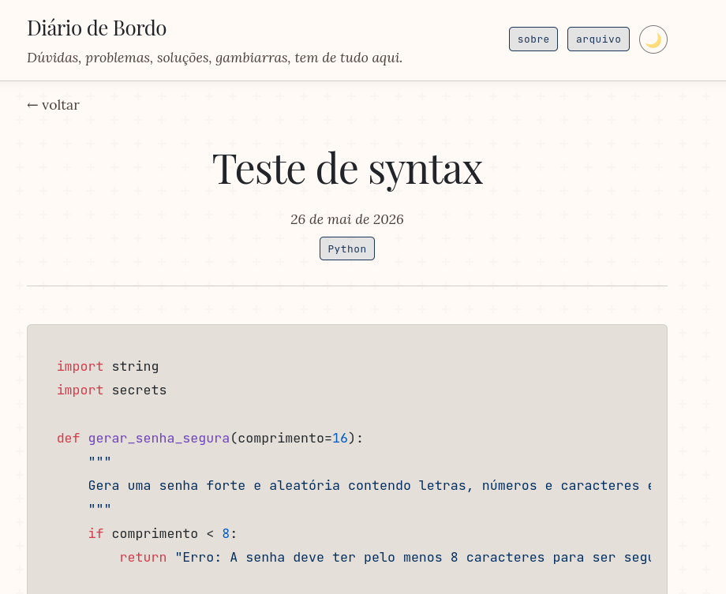
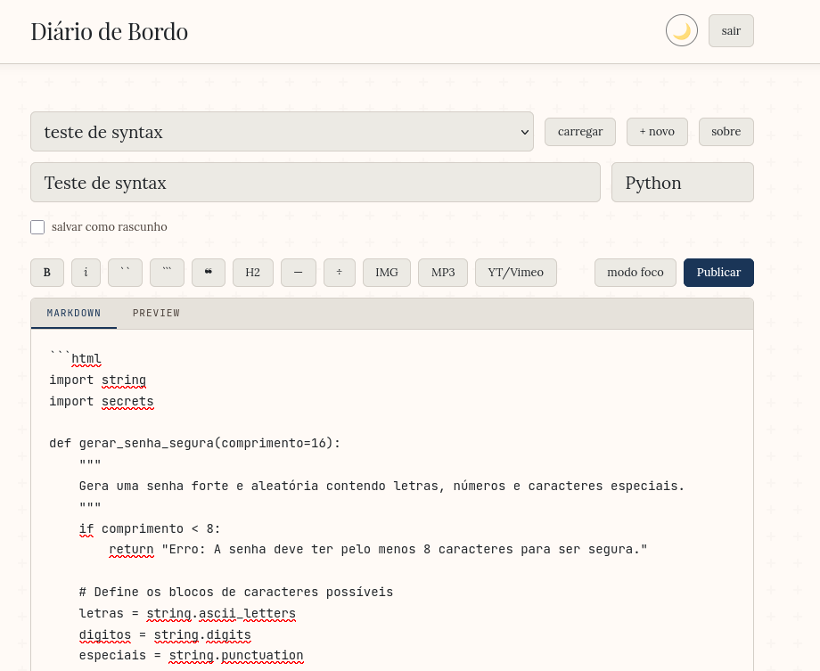

# Um Blog Simples

Um blog pessoal feito em PHP puro, sem banco de dados, sem frameworks, sem complicação. Os posts são arquivos `.md` salvos no servidor. Você escreve, publica, e pronto.

---

## Screenshots







---

## O que é

Um blog minimalista para quem quer escrever sem depender de WordPress, Ghost, ou qualquer sistema pesado. Funciona em qualquer hospedagem compartilhada com PHP. Não precisa de banco de dados.

**Como funciona:**
- Cada post é um arquivo `.md` salvo na pasta `/posts/`
- O PHP lê o arquivo, converte o Markdown para HTML e entrega para o visitante
- Um cache em arquivo garante que páginas já visitadas sejam entregues direto do disco, sem reprocessar

---

## Funcionalidades

- ✅ Editor web com preview ao vivo
- ✅ Formatação Markdown (negrito, itálico, código, listas, tabelas, citações...)
- ✅ Syntax highlight em blocos de código (via highlight.js)
- ✅ Upload de imagens e áudios direto pelo editor
- ✅ Incorporação de vídeos do YouTube e Vimeo
- ✅ Página de arquivo organizada por mês
- ✅ Modo escuro (persiste entre visitas)
- ✅ Cache em arquivo — suporta muito tráfego sem banco de dados
- ✅ Rascunhos (não aparecem na listagem pública)
- ✅ Autenticação por senha para o editor
- ✅ Design responsivo para mobile

---

## Requisitos

- Hospedagem com PHP 8.0 ou superior
- Sem banco de dados
- Sem Composer
- Sem Node.js

---

## Instalação

### 1. Baixe os arquivos

Faça o download do repositório como `.zip` pelo GitHub (botão verde **Code → Download ZIP**) ou clone via terminal:

```bash
git clone https://github.com/seu-usuario/umblogsimples.git
```

### 2. Configure o blog

Renomeie o arquivo `config.example.php` para `config.php`:

```bash
cp config.example.php config.php
```

Abra o `config.php` e preencha com os seus dados:

```php
define('BLOG_TITLE',    'Meu Blog');       // Nome do blog
define('BLOG_SUBTITLE', 'escrevo aqui.');  // Subtítulo
define('BLOG_PASSWORD', 'sua-senha');      // Senha do editor — troque isso!
define('UPLOADS_URL',   '/uploads');       // URL pública da pasta de uploads
```

> ⚠️ **Importante:** nunca suba o `config.php` para o GitHub. Ele está no `.gitignore` por padrão.
>
> 💡 **Se o blog estiver em uma subpasta** (ex: `seusite.com/blog`), ajuste os caminhos:
> ```php
> define('UPLOADS_URL', '/blog/uploads');
> ```

### 3. Crie as pastas no servidor

No servidor, você precisará das seguintes pastas com permissão **755**:

```
/posts/
/uploads/
/cache/
```

As pastas já existem no repositório com seus respectivos `.htaccess` de proteção. Se precisar criá-las manualmente (via FTP ou painel de hospedagem), crie-as e ajuste as permissões para 755 pelo gerenciador de arquivos.

### 4. Proteção das pastas

Cada pasta sensível tem um `.htaccess` próprio já incluído no repositório:

| Pasta | Proteção |
|---|---|
| `/posts/` | Bloqueia acesso direto aos arquivos `.md` |
| `/uploads/` | Permite apenas imagens e áudios — bloqueia execução de PHP |
| `/cache/` | Bloqueia acesso direto aos arquivos de cache |

### 5. Suba os arquivos para o servidor

Envie todos os arquivos para o servidor via FTP ou pelo painel de hospedagem. Se o blog vai ficar na raiz do site (`seusite.com`), suba tudo para a raiz. Se vai ficar em uma subpasta (`seusite.com/blog`), suba para essa subpasta.

### 6. Acesse o editor

Abra no navegador:

```
seusite.com/editor.php
```

Digite a senha que você definiu no `config.php` e comece a escrever.

---

## Como usar

### Escrevendo um post

1. Acesse `seusite.com/editor.php`
2. Digite o título e a tag do post
3. Escreva o conteúdo em Markdown
4. Clique em **Publicar** ou use o atalho `Ctrl+S`

O post aparece imediatamente na home.

### Rascunhos

Marque a opção **salvar como rascunho** antes de publicar. Rascunhos não aparecem na listagem pública e retornam 404 se acessados diretamente. Para publicar depois, carregue o post no editor, desmarque a opção e publique novamente.

### Markdown suportado

| Sintaxe | Resultado |
|---|---|
| `**texto**` | **negrito** |
| `_texto_` | _itálico_ |
| `~~texto~~` | ~~tachado~~ |
| `` `código` `` | código inline |
| ` ``` ` (bloco) | bloco de código com syntax highlight |
| `> texto` | citação |
| `## Título` | subtítulo |
| `- item` | lista |
| `1. item` | lista ordenada |
| `- [ ] tarefa` | lista de tarefas |
| `` | imagem |
| `` | player de áudio |
| `[texto](url)` | link |
| `\| col \| col \|` | tabela |

### Blocos de código com syntax highlight

Use três crases para abrir e fechar o bloco. Opcionalmente, especifique a linguagem logo após as crases de abertura:

````
```python
def hello():
    print("olá!")
```
````

Linguagens suportadas: `python`, `javascript`, `php`, `bash`, `html`, `css`, `json`, `sql` e [muitas outras](https://highlightjs.org/demo).

### Arquivo por mês

A página `arquivo.php` lista todos os meses com o número de posts de cada um. Clique em um mês para ver os posts daquele período.

Na home, o nome do mês também é clicável e leva para a mesma página filtrada.

### Editando a página Sobre

No editor, clique no botão **sobre** ao lado do seletor de posts. O conteúdo do `sobre.md` é carregado no editor. Edite e clique em **Publicar** — o cache é invalidado automaticamente.

### Apagando um post

1. Apague o arquivo `.md` da pasta `/posts/`
2. Apague o arquivo `.html` correspondente da pasta `/cache/`
3. Apague também `/cache/index.html` e qualquer `/cache/arquivo*.html` para as listagens atualizarem

### Cache

O cache é gerado automaticamente na primeira visita a cada página e salvo em `/cache/` como um arquivo `.html`. Nas visitas seguintes o arquivo é entregue direto, sem processar nada.

**Invalidação automática** — ao publicar ou editar um post o cache é limpo automaticamente:
- Cache do post editado
- `cache/index.html` — home
- `cache/arquivo*.html` — páginas de arquivo por mês

**Limpeza manual** — se precisar forçar a regeneração de tudo, apague todos os arquivos `.html` dentro da pasta `/cache/`. Na próxima visita tudo é regenerado.

**Quando limpar manualmente:**
- Após atualizar o `style.css` ou qualquer arquivo PHP
- Após alterar o `sobre.md` diretamente pelo FTP
- Se alguma página parecer desatualizada

---

## Estrutura do projeto

```
/
├── .gitignore
├── README.md
├── config.example.php      ← modelo de configuração
├── config.php              ← suas configurações (não sobe para o GitHub)
├── style.css               ← todo o design
├── index.php               ← listagem pública de posts
├── post.php                ← leitura de post individual
├── editor.php              ← editor web protegido por senha
├── api.php                 ← salva posts, uploads e edição do sobre
├── arquivo.php             ← listagem de posts por mês
├── sobre.php               ← página sobre
├── sobre.md                ← conteúdo da página sobre (editável pelo editor)
├── screenshots/            ← imagens para o README
├── posts/
│   └── .htaccess           ← bloqueia acesso direto aos .md
├── uploads/
│   └── .htaccess           ← permite só imagens e áudios, bloqueia PHP
└── cache/
    └── .htaccess           ← bloqueia acesso direto ao cache
```

---

## Hospedagem

Funciona em qualquer hospedagem compartilhada com PHP 8.0+. Testado na [Hostinger](https://www.hostinger.com.br) e similares.

---

## Licença

MIT — use, modifique e distribua à vontade.

---

## Segurança

### Gerando o hash da senha

O blog não armazena a senha em texto puro — usa um hash seguro (bcrypt). Você precisa gerar o hash **uma vez** antes de configurar o blog.

---

> ### 🔑 Gerador online (jeito mais fácil)
> Acesse **[bcrypt-generator.com](https://bcrypt-generator.com)**, digite sua senha e clique em **Generate**. Copie o resultado e cole no `config.php`.

---

**No Linux ou Mac**, abra o terminal e rode:

```bash
php -r "echo password_hash('sua-senha-aqui', PASSWORD_DEFAULT);"
```

**No Windows**, abra o PowerShell e rode:

```powershell
php -r "echo password_hash('sua-senha-aqui', PASSWORD_DEFAULT);"
```

> Se o PHP não estiver instalado localmente, use o gerador online acima.

Em qualquer caso, o resultado será algo assim:

```
$2y$12$xK9mN3pQrS5tUvWxYzAbCdEfGhIjKlMnOpQrStUvWxYzAbCdEfG
```

Cole esse valor no `config.php`:

```php
define('BLOG_PASSWORD_HASH', '$2y$12$xK9mN3pQrS5tUvWxYzAbCdEfGhIjKlMnOpQrStUvWxYzAbCdEfG');
```

> ⚠️ **Nunca coloque a senha em texto puro** — sempre use o hash gerado.

### O que está protegido

| Proteção | Como funciona |
|---|---|
| Acesso ao `config.php` | Bloqueado via `.htaccess` |
| Acesso ao `api.php` | Protegido por sessão + CSRF — acesso sem autenticação retorna 401 |
| Acesso direto aos `.md` | Bloqueado via `.htaccess` na pasta `/posts/` |
| Execução de PHP em uploads | Bloqueado via `.htaccess` na pasta `/uploads/` |
| Acesso ao cache | Bloqueado via `.htaccess` na pasta `/cache/` |
| Força bruta no login | Bloqueio automático após 5 tentativas por 15 minutos |
| Ataques CSRF | Token validado em todas as requisições do editor |
| Upload malicioso | Validação de extensão + magic bytes para imagens |
| Upload em massa | Rate limit de 20 uploads por minuto por sessão |

---

## URLs limpas

Os posts usam URLs limpas — sem `post.php?slug=` na barra de endereços:

```
seusite.com/blog/2026-05-26-titulo-do-post
```

Isso é feito via rewrite no `.htaccess` raiz. O PHP não muda nada — internamente o slug continua sendo usado para tudo.

**Se o blog estiver em subpasta**, o `RewriteBase` no `.htaccess` precisa refletir o caminho:

```apache
RewriteBase /blog/
```

Se estiver na raiz do site:

```apache
RewriteBase /
```

---

## Página Sobre

O conteúdo da página Sobre fica no arquivo `sobre.md` na raiz do blog. Para editar:

1. Acesse o editor (`editor.php`)
2. Clique no botão **sobre** ao lado do seletor de posts
3. Edite o conteúdo em Markdown
4. Clique em **Publicar**

O cache da página é invalidado automaticamente ao salvar.

---

## Analytics com Umami

O blog não inclui nenhum script de analytics por padrão — você adiciona o seu próprio se quiser.

Recomendamos o **[Umami](https://umami.is)** — open source, sem cookies, sem banner de consentimento, compatível com GDPR.

**Como configurar:**

1. Crie uma conta em [umami.is](https://umami.is)
2. Adicione seu site e copie o snippet gerado
3. Cole o snippet no `<head>` de cada página pública antes do `</head>`:

```html
<script defer src="https://cloud.umami.is/script.js" data-website-id="SEU-ID-AQUI"></script>
```

Páginas para adicionar: `index.php`, `post.php`, `arquivo.php`, `sobre.php`.
O editor (`editor.php`) não precisa ser rastreado.

> ⚠️ Não suba o snippet para o GitHub — ele contém o ID do seu site.

---

## Dicas de Markdown

**Sempre deixe uma linha em branco** entre parágrafos, títulos, listas e blocos de código. Sem a linha em branco o parser trata tudo como um bloco só.

✅ Correto:
```
Este é um parágrafo.

## Título da seção

Este é outro parágrafo.
```

❌ Incorreto:
```
Este é um parágrafo.
## Título da seção
Este é outro parágrafo.
```
